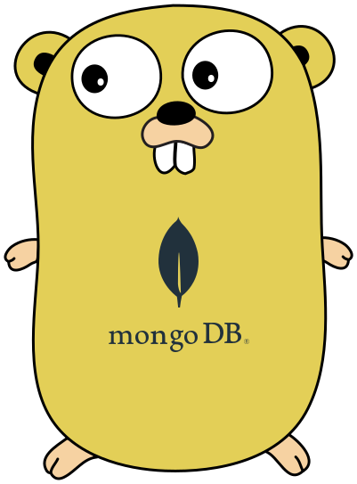

# mango



Use [mongo-go-driver](https://github.com/mongodb/mongo-go-driver) like [mgo](https://github.com/globalsign/mgo)

Why named mango?

产品妹子：你们常说的芒果db是什么

- [Installation](#installation)
- [Usage](#usage)
- [Doc](#doc)

## installation

`go get -u github.com/amorist/mango`

## usage

```go
package main

import (
    "fmt"

    "github.com/amorist/mango"

    "github.com/amorist/mango/bson"
)

// Person person model
type Person struct {
    ID   bson.ObjectID `bson:"_id" json:"_id"`
    Name string        `bson:"name" json:"name"`
}

func main() {
    session := mango.New("mongodb://127.0.0.1")
    session.SetPoolLimit(10)

    if err := session.Connect(); err != nil {
        fmt.Println(err)
        return
    }

    // Find find all
    var result []Person
    if err := session.DB("test").Collection("persons").Find(bson.M{}).All(&result); err != nil {
        fmt.Println(err)
    }

    for _, r := range result {
        fmt.Println(r.Name)
    }

    // Update
    if err := session.DB("test").Collection("persons").Update(bson.M{"name": "name1"}, bson.M{"$set": bson.M{"name": "name2"}}); err != nil {
        fmt.Println(err)
    }

    // Update UpdateAll
    info, err := session.DB("test").Collection("persons").UpdateAll(bson.M{"name": "name1"}, bson.M{"$set": bson.M{"name": "name"}})
    if err != nil {
        fmt.Println(err)
    }
    fmt.Println(info)

    // Remove
    if err := session.DB("test").Collection("persons").Remove(bson.M{"name": "name"}); err != nil {
        fmt.Println(err)
    }

    // RemoveAll
    if err := session.DB("test").Collection("persons").RemoveAll(bson.M{"name": "name"}); err != nil {
        fmt.Println(err)
    }

    // Insert
    if err := session.DB("test").Collection("persons").Insert(bson.M{"name": "name"}); err != nil {
        fmt.Println(err)
    }

    // Insert
    var docs []interface{}
    for index := 0; index < 10; index++ {
        docs = append(docs, bson.M{"name": index})
    }

    if err := session.DB("test").Collection("persons").InsertAll(docs); err != nil {
        fmt.Println(err)
    }

    // Count
    count, err := session.DB("test").Collection("persons").Count(bson.M{"name": "name"})
    if err != nil {
        fmt.Println(err)
    }
    fmt.Println(count)
}
```

## doc

[mango](https://godoc.org/github.com/amorist/mango)
